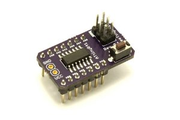
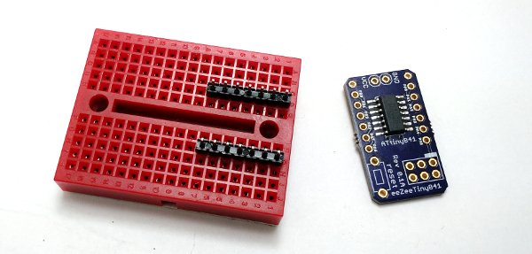
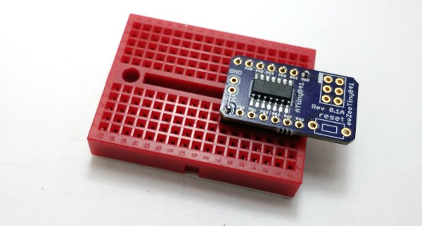
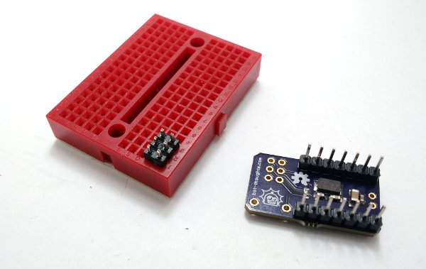
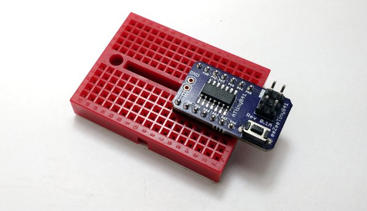
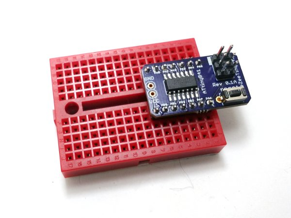

# eeZeeTiny841 User Guide



## Introduction

The new, powerful ATtiny841 features 14 pins, two USARTs, SPI, I2C slave, three timers, ADC and more. The eeZeeTiny841 board exposes all pins and adds a reset circuit, AVR ISP programming interface, bypass capacitors, and optional crystal: all in a compact breadboard-friendly form factor.

Want one? [Buy now on Tindie](https://www.tindie.com/products/bot_thoughts/eezeetiny841/).

### Pinout


## How to Assemble

Assembly is easy. And, you can learn how to solder at the same time. Review [Sparkfun's Soldering Tutorial](https://learn.sparkfun.com/tutorials/how-to-solder---through-hole-soldering) if you need to. Here's a helpful info-graphic from the tutorial:


### You'll need
* Soldering iron, 40W
* Sponge to clean the iron (I recommend a brass sponge)
* Workbench with plenty of light
* Ventilation since breathing flux fumes is irritating
* Soldering surface (e.g., marble tile sample)
* Rosin core solder 0.022” or 0.032” diameter
* Kester #2331-ZX flux pen (optional)

### Pin Headers

* Insert the two 7-pin headers on a breadboard, spaced 5 rows apart, short side of the pins facing up.



* Place the eeZeeTiny841 on top of the pin headers. MCU side up.
* Hold board down while soldering one pin in each rows



* Solder the remaining pin headers in place.

### AVR ISP Header

* Insert the 2x3 AVR ISP header into the breadboard, short pins up.



* Place the eeZeeTiny841 board onto the 2x3 header
* Holding the board in place, solder one pin.


* Check vertical alignment of the ISP header and adjust by melting the solder joint, if necessary.
* Solder the remaining 5 pins.



### Reset Switch

* Insert the board into the breadboard right side up.
* Install the switch and bend the pins if necessary to hold it in place.



* Solder the switch from the top
* Remove the board and solder the pins from the bottom

### Power (optional)

* Install the 2-pin header into the breadboard, short side up
* Place the eeZeeTiny841 onto the pin header so the header sticks up on the MCU side
* Hold the board in place and solder one pin
* Check vertical alignment of the header and adjust by re-melting the solder joint.
* Solder the remaining pin.

### Cleanup

You'll want to remove the rosin and flux

I usually just use isopropyl alcohol and an old toothbrush

You can also buy chemicals specifically for removing flux and rosin


## Getting Started

To get started writing code for ATtiny, you need:

  * a standard *AVR-GCC and IDE*, or you can use *Arduino*.
  * a hardware programmer for *Flashing the Chip*

### Arduino

 1. Download the Arduino IDE if you don't have it yet.
 * Next, install Spence's [arduino-tiny-841 core](https://github.com/SpenceKonde/arduino-tiny-841)
   * In Arduino 1.6.* you can install this from the Boards Manager
   * For older Arduino, follow the instructions above. Also, you may need to add the correct ```avrdude.conf``` file
 * For I2C (the 841 hardware only supports slave I2C) you'll need the [WireS library](https://github.com/orangkucing/WireS)
 * [Update fuses](https://github.com/shimniok/eeZeeTiny841/tree/master/examples/fuses) to use the onboard crystal, if installed. Refer to the datasheet or see *ATtiny841 Fuses* below.
   * HFUSE
   * LFUSE
   * EFUSE

### AVR-GCC and IDE

Install the avr-gcc toolchain and a suitable IDE:

  * IDE: [AVR Studio](http://www.atmel.com/tools/STUDIOARCHIVE.aspx) or [Atmel Studio](http://www.atmel.com/microsite/atmel_studio6/) on Windows or
  * IDE: Eclipse and the [AVR Plugin](http://avr-eclipse.sourceforge.net/wiki/index.php/The_AVR_Eclipse_Plugin) on all platforms.
  * Toolchain: install  [ATmel AVR Toolchain](http://www.atmel.com/products/microcontrollers/avr/tinyAVR.aspx?tab=tools) for either Windows or Linux.
  * Flashing: install the latest version of [avrdude](http://www.nongnu.org/avrdude/), then add the contents of [add\_to\_avrdude.conf](https://raw.githubusercontent.com/shimniok/eeZeeTiny841/master/setup/add_to_avrdude.conf) -- located in the setup directory of this repo -- to your avrdude.conf (as of May 17, 2017).

Location of avrdude.conf depends on your operating system, and the method of installation (rpm, distro, which package used, etc.)

### Flashing The Chip

#### Programmers
I use and recommend the following programmers:

  * [AVR Dragon](http://www.newark.com/atmel/atavrdragon/in-circuit-debug-prog-jtag-spi/dp/68T2063) - low cost, with debuggging. See below for installation.
  * [pololu.com Pololu AVR Programmer](http://www.pololu.com/product/1300). Follow the instructions in the [User's Guide pdf](http://www.pololu.com/docs/0J36)

You can also use an AVRISP MkII, your Arduino ([here's how](http://arduino.cc/en/Tutorial/ArduinoISP)), or other AVR ISP compatible hardware.

#### Arduino and Programmers
Spence's ATTiny core supports a number of programmers, but not AVR Dragon (as of May 17, 2017). To add it, you'll need to add the following to his package's programmers.txt file.

On Linux this is located in ~/.arduino15/packages/ATTinyCore/avr/*/programmers.txt where * is a version number of the package. On Windows look for ATTinyCore/avr/*/programmers.txt in %HOMEPATH%\AppData\Roaming\Arduino15\packages\

Simply add the contents of [add_to_programmers.txt](https://raw.githubusercontent.com/shimniok/eeZeeTiny841/master/setup/add_to_programmers.txt) -- located in the setup directory of this repo -- to the programmers.txt file.

#### ISP Header

When it's time to plug in the eeZee Tiny board, locate the white rectangle next to the ISP header which marks pin 1.


### Example Code

 * [avr-gcc examples](https://github.com/shimniok/eeZeeTiny841/tree/master/examples)
 * [Arduino examples](https://github.com/shimniok/eeZeeTiny841/tree/master/examples/arduino)

## Operating Conditions

Please use your ATtiny breakout boards with regulated supplies of 5V or less, with minimal ripple, at temperatures around 25C (77F). Do not use the boards in high temperature conditions.

## ATtiny841 Fuses

When eeZee Tiny841 ships, the fuses are set as indicated with * below. If your board has a crystal oscillator, you'll want to change LFUSE as indicated by **

You can use [this makefile](https://github.com/shimniok/eeZeeTiny841/tree/master/examples/fuses) to update your fuses to use the onboard crystal (if installed) or internal oscillator.

### HFUSE
Ships with HFUSE=0xDF

| Bit # | Bit Name | Use | Settings |
|------:|----------|-----|----------|
| 7 | RSTDISBL | disable reset | disabled=0, enabled=1* |
| 6 | DWEN | enable debugWIRE | enabled=0, disabled=1* |
| 5 | SPIEN | enable SPI programming | *enabled=0, disabled=1 |
| 4 | WDTON | watchdog timer permanently on | on=0 off=1* |
| 3 | EESAVE | preserve EEPROM during chip erase | enable=0, disable=1* |
| 2:0 | BODLEVEL | sets brown out disable trigger level, see EFUSE | 1.8V=111*, 2.5V=101 4.3V=100 |

### LFUSE
Ships with LFUSE=0xE2

| Bit # | Bit Name | Use | Settings |
|------:|----------|-----|----------|
| 7 | CKDIV8 | divide clock by 8 | enable=0, disable=1* |
| 6 | CKOUT | output sys clock on port pin | disable=1*, enable=0 |
| 5 | Not used | Not used | set to 0 |
| 4 | SUT | system startup time (SUT) | see CKSEL |
| 3:0 | CKSEL | select clock source| see CKSEL |

#### CKSEL
| Source | From PD SUT | CKSEL bits |
|--------|-------------|------------|
| internal 8MHz | 6CK | 00010* |
| external | 6CK | 00000 |
| internal 32-512kHz | 6CK | 00100 |
| LF Xtal Osc | 1K CK | 00110 |
| LF Xtal Osc | 32K | 10110 |
| Xtal Osc, Cer Res 0.4-0.9MHz | 258 CK | 01000 |
| Xtal Osc, Cer Res 0.4-0.9MHz | 1K CK | 11000 |
| Xtal Osc, Cer Res 0.4-0.9MHz | 16K CK | 01001 |
| Xtal Osc, Cer Res 0.9-3MHz | 258 CK | 01010 |
| Xtal Osc, Cer Res 0.9-3MHz | 1K CK | 11010 |
| Xtal Osc, Cer Res 0.9-3MHz | 16K CK | 01011 |
| Xtal Osc, Cer Res 3-8MHz | 258 CK | 01100 |
| Xtal Osc, Cer Res 3-8MHz | 1K CK | 11100 |
| Xtal Osc, Cer Res 3-8MHz | 16K CK | 01101 |
| Xtal Osc, Cer Res >8MHz | 258 CK | 01110 |
| Xtal Osc, Cer Res >8MHz | 1K CK | 11110 |
| Xtal Osc, Cer Res >8MHz | 16K CK | 01111** |

### EFUSE
Ships with EFUSE=0xFF

| Bit # | Bit Name | Use | Settings |
|------:|----------|-----|----------|
|	7:5 | ULPOSCSEL | ULP Oscillator Select | 32kHz=111*, 64kHz=110, 128kHz=101, 256kHz=100, 512kHz=011 |
| 4:3 | BODPD | Brown Out Disable, Power Down mode | disabled=11*, sampled=01, enabled=10 |
| 2:1 | BODACT | Brown Out Disable, Active mode | disabled=11*, sampled=01, enabled=10 |
| 0 | SELFPRGEN | Self Program Enable | disabled=1*, enabled=0 |

## Default Image

During testing, I flash the *larson scanner* example software onto the chip and then test every pin for connectivity.
